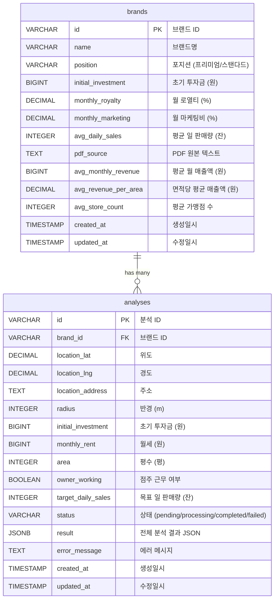

# StartSmart 데이터베이스 ERD

## Mermaid 다이어그램

## 테이블 관계 설명

### brands (브랜드 테이블)
- **역할**: 프랜차이즈 브랜드의 기본 정보 및 평균 성과 데이터 저장
- **주요 필드**:
  - `id`: 브랜드 고유 ID (예: "brand_1", "brand_2")
  - `name`: 브랜드명 (예: "스타벅스", "이디야커피")
  - `position`: 브랜드 포지션 ("프리미엄" 또는 "스탠다드")
  - `initial_investment`: 초기 투자금 (원)
  - `monthly_royalty`: 월 로열티 비율 (%)
  - `monthly_marketing`: 월 마케팅비 비율 (%)
  - `avg_daily_sales`: 평균 일 판매량 (잔)
  - `avg_monthly_revenue`: 평균 월 매출액 (원) - 예측에 사용
  - `avg_revenue_per_area`: 면적(3.3㎡)당 평균 매출액 (원)
  - `avg_store_count`: 평균 가맹점 수

### analyses (분석 결과 테이블)
- **역할**: 사용자가 요청한 분석의 입력 조건 및 결과 저장
- **주요 필드**:
  - `id`: 분석 고유 ID (예: "analysis_1234567890_abc123")
  - `brand_id`: 분석 대상 브랜드 ID (brands 테이블 참조)
  - `location_lat`, `location_lng`: 분석 대상 위치 좌표
  - `location_address`: 분석 대상 주소
  - `radius`: 상권 분석 반경 (m)
  - `initial_investment`: 사용자 입력 초기 투자금
  - `monthly_rent`: 사용자 입력 월세
  - `area`: 사용자 입력 평수
  - `owner_working`: 점주 근무 여부
  - `target_daily_sales`: 목표 일 판매량
  - `status`: 분석 상태
    - `pending`: 대기 중
    - `processing`: 진행 중
    - `completed`: 완료
    - `failed`: 실패
  - `result`: 전체 분석 결과 (JSONB 형식)
    - 상권 분석 결과
    - 손익 계산 결과
    - 로드뷰 분석 결과
    - AI 컨설팅 결과
    - 판단 결과

### 관계
- **brands 1:N analyses**: 하나의 브랜드는 여러 분석 결과를 가질 수 있음
- **Foreign Key**: `analyses.brand_id` → `brands.id`

## 인덱스

- `idx_analyses_brand_id`: 브랜드별 분석 조회 최적화
- `idx_analyses_status`: 상태별 분석 조회 최적화
- `idx_analyses_created_at`: 생성일시 기준 정렬 최적화

## 데이터 흐름

1. **브랜드 데이터 입력**: PDF 파일에서 추출하여 `brands` 테이블에 저장
2. **분석 요청**: 사용자가 분석을 요청하면 `analyses` 테이블에 레코드 생성 (status: pending)
3. **분석 진행**: 오케스트레이터가 분석을 진행하며 status를 processing으로 변경
4. **결과 저장**: 분석 완료 후 `result` 필드에 JSONB 형식으로 저장 (status: completed)
5. **결과 조회**: 프론트엔드에서 `result` 필드를 조회하여 대시보드에 표시
